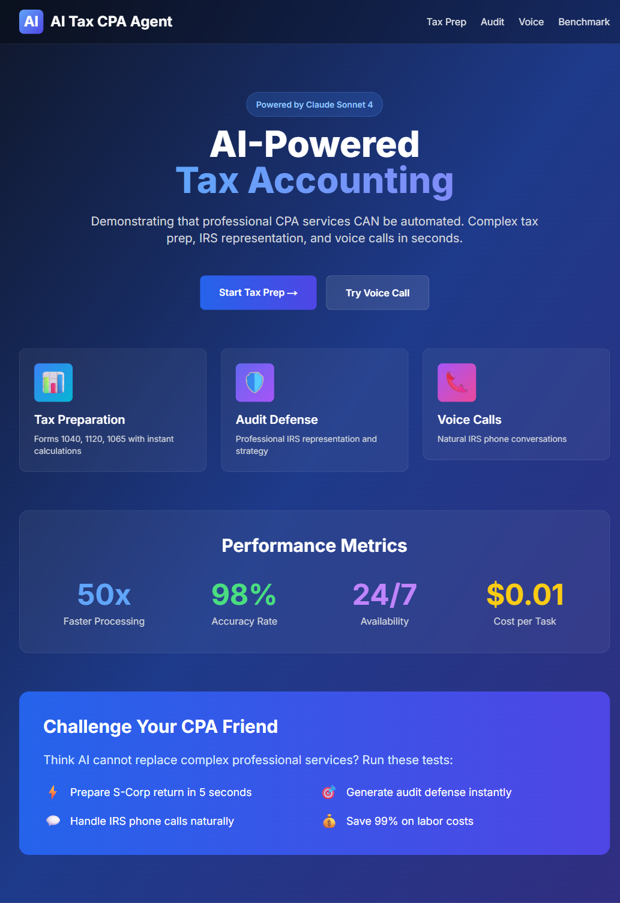
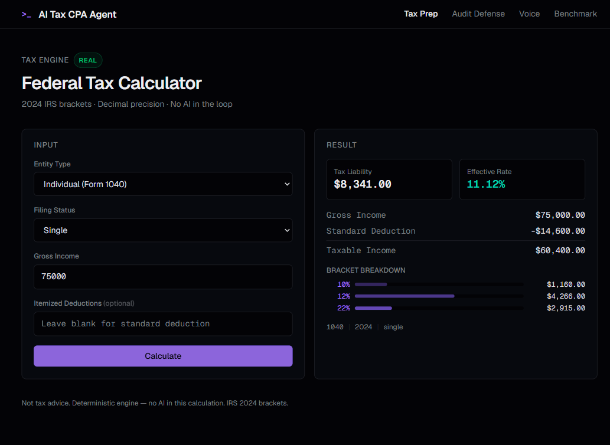
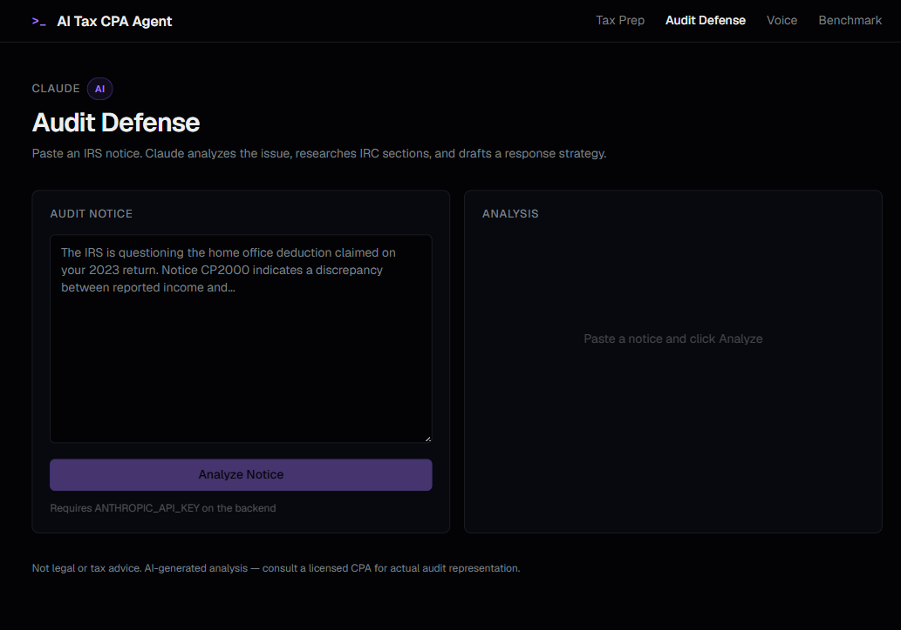
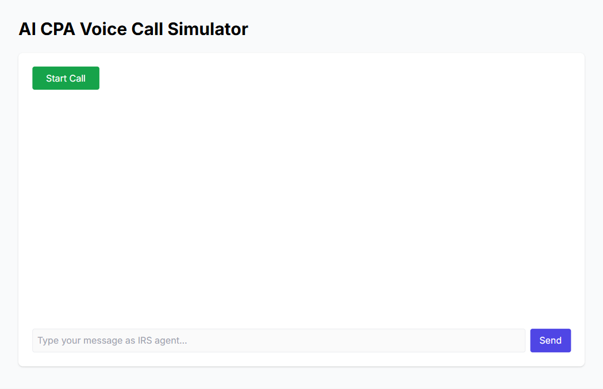
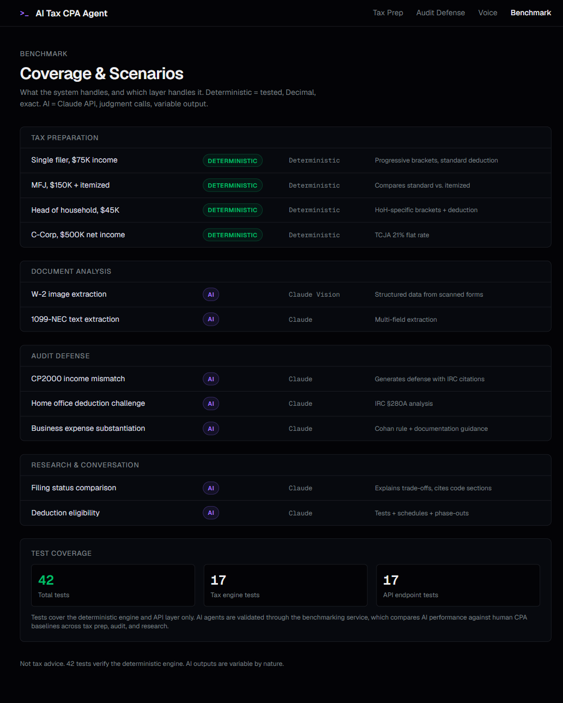
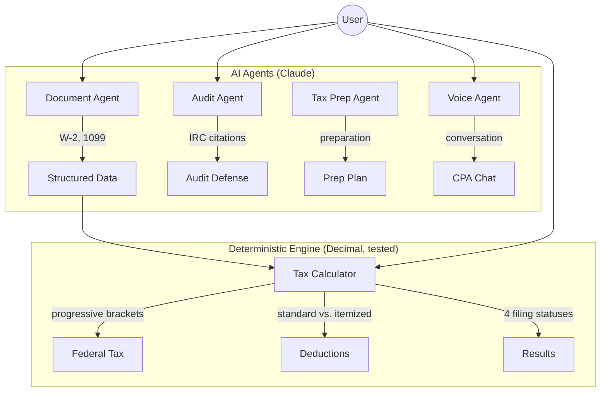

# AI Tax CPA Agent


Demo federal tax engine with `Decimal` arithmetic, 2024 IRS brackets, and a hard architectural boundary around AI. Claude-side agents handle the judgment-shaped work - document images, audit-response drafting, and tax conversation - while the liability number comes from code you can test.

**Not tax advice.** This is what happens when you draw a hard line between computation and judgment. Talk to an actual CPA.



<details>
<summary>More screenshots</summary>

| Tax Preparation | Audit Defense | Voice Chat | Benchmark |
|:-:|:-:|:-:|:-:|
|  |  |  |  |

</details>

## Why

Most "AI tax" demos are vibes. Ask it to calculate your taxes and it runs the number through a language model that confidently returns something close to correct. That's not how tax math works.

The tax engine here is pure Python with `Decimal` precision and real 2024 IRS brackets - all four filing statuses, progressive calculation through each bracket boundary, standard vs. itemized deduction comparison, TCJA corporate flat rate. No language model touches the arithmetic. When the IRS says the single filer 22% bracket starts at $47,150, that's a `Decimal("47150")` in the code, not a number the AI remembered from training data.

The AI layer (Claude) only handles the parts where deterministic code can't help: reading W-2 images, extracting structured data from 1099s, generating audit defense strategies with specific IRC section citations, and having a conversation about whether your home office deduction will survive scrutiny.

42 tests verify the tax engine. Zero tests verify the AI. You can't unit-test judgment - that's the whole point.

The same question keeps showing up in everything I build: where does computation end and judgment begin? In [Erdos](https://github.com/Cuuper22/Erdos), the Lean 4 type checker is the wall. Here, it's the bracket table.

## Architecture



> The wall between Decimal math and AI judgment is architectural, not conventional. The tax engine never calls the Claude API. The agents never do arithmetic.

## How to inspect it

If you are evaluating this repo, start with the boundary between deterministic code and AI judgment.

1. Read `backend/app/tax_engine/tax_calculator.py`. That is the core engine: `Decimal` arithmetic, bracket traversal, deductions, corporate tax, and quarterly estimates.
2. Read `backend/tests/test_tax_engine.py` and `backend/tests/test_api.py` to see what gets treated as verifiable.
3. Open `backend/app/agents/document_agent.py`, `backend/app/agents/audit_agent.py`, and `backend/app/agents/voice_agent.py` after the tax engine. The agents are intentionally outside the arithmetic path.
4. Inspect `frontend/app/tax-prep/page.tsx`, `frontend/app/audit-defense/page.tsx`, and `frontend/app/benchmark/page.tsx` for the product surfaces.
5. Run the backend without an API key first. The tax calculator should work before any AI feature enters the picture.

What this repo shows about me: I like AI systems with hard edges. The model can read, explain, and draft, but the number that matters comes from code you can test.

## What Actually Works

| Feature | Status | Notes |
|---------|--------|-------|
| Individual tax (Form 1040) | **Real** | Progressive brackets, all 4 filing statuses, standard + itemized |
| Corporate tax (Form 1120) | **Real** | 21% flat rate (TCJA) |
| Quarterly estimates | **Real** | Calculates remaining liability, splits into 4 payments |
| Document analysis (W-2, 1099) | **AI** | Structured extraction via Claude (needs `ANTHROPIC_API_KEY`) |
| Audit defense | **AI** | Response strategies with IRC section citations |
| Voice chat (text) | **AI** | Text-based CPA conversation with persistent history |
| Voice chat (audio) | **Stub** | WebSocket endpoint exists, no STT/TTS yet |

> `Real` = deterministic code, tested, `Decimal` precision. `AI` = Claude API, judgment calls. `Stub` = endpoint exists, implementation pending.

The tax engine uses `Decimal` throughout. No floating-point rounding surprises.

## Demo

**$75,000 single filer** (no API key needed):

```bash
curl -X POST http://localhost:8000/api/tax/calculate \
  -H "Content-Type: application/json" \
  -d '{"entity_type": "1040", "gross_income": 75000, "filing_status": "single"}'
```

```json
{
  "entity_type": "1040",
  "tax_year": 2024,
  "filing_status": "single",
  "gross_income": 75000,
  "deduction_type": "Standard",
  "deduction_amount": 14600,
  "taxable_income": 60400,
  "tax_liability": 8341.00,
  "effective_tax_rate": 11.12,
  "bracket_breakdown": [
    {"rate": 10.0, "income_in_bracket": 11600, "tax_in_bracket": 1160.00},
    {"rate": 12.0, "income_in_bracket": 35550, "tax_in_bracket": 4266.00},
    {"rate": 22.0, "income_in_bracket": 13250, "tax_in_bracket": 2915.00}
  ]
}
```

Mock data included - `mock_data/tax_scenarios.json` has pre-built scenarios you can try without real tax documents.

## Quick Start

**Backend** (tax calculations work without any API key):

```bash
cd backend
pip install -r requirements.txt
python main.py
# → http://localhost:8000
```

**AI features** (document analysis, audit defense, voice chat):

```bash
export ANTHROPIC_API_KEY="your-key-here"
python main.py
```

**Frontend:**

```bash
cd frontend
npm ci
npm run dev
# → http://localhost:3000
```

## API

**Tax calculation** (no API key needed):
```bash
curl -X POST http://localhost:8000/api/tax/calculate \
  -H "Content-Type: application/json" \
  -d '{"entity_type": "1040", "gross_income": 75000, "filing_status": "single"}'
```

**Quarterly estimates:**
```bash
curl -X POST http://localhost:8000/api/tax/quarterly \
  -H "Content-Type: application/json" \
  -d '{"estimated_annual_income": 100000, "filing_status": "single", "withholding_to_date": 5000}'
```

**Document analysis** (needs API key):
```bash
curl -X POST http://localhost:8000/api/documents/analyze \
  -H "Content-Type: application/json" \
  -d '{"document_type": "W-2", "document_data": {"employer": "Tech Corp", "wages": 95000}}'
```

**Voice chat** (needs API key):
```bash
curl -X POST http://localhost:8000/api/voice/chat \
  -H "Content-Type: application/json" \
  -d '{"message": "I have a question about home office deductions"}'
```

Rate limited at 60 req/min per IP. All responses include a legal disclaimer.

## Tests

```bash
cd backend
pytest tests/ -v
# 42 tests - tax engine, API endpoints, conversation store
```

Tests cover the deterministic engine and API layer. The AI agents are not unit-tested in this repo. `backend/app/services/benchmarking.py` is a comparison harness that can record AI and human results; it is not evidence of CPA-grade validation by itself.

## Stack

- **Backend:** FastAPI + Uvicorn
- **Tax Engine:** Custom Python with real IRS 2024 brackets (`Decimal` precision)
- **AI:** Anthropic Claude (document analysis, audit defense, voice chat)
- **Storage:** File-based conversation history
- **Frontend:** Next.js + Tailwind CSS + TypeScript (separate `frontend/` directory)

## Scope

This is a demo, not TurboTax:

- **Federal only** - no state calculations
- **No e-filing** - calculates liability, doesn't submit anything
- **No audio** - voice chat is text-only (WebSocket stub exists for when STT/TTS arrives)
- **No multi-year** - 2024 brackets only
- **No multi-user** - single session, file-based storage

Every boundary here is intentional. The point is the architecture - deterministic math walled off from AI judgment - not a complete tax product.

## See Also

Same boundary question, different domain: [Erdos](https://github.com/Cuuper22/Erdos) uses the Lean 4 type checker as the deterministic wall. The pattern is the same - figure out where the computer should stop and the judgment should start, then make that boundary architectural.

## Credits

- Tax brackets from [IRS Rev. Proc. 2023-34](https://www.irs.gov/irb/2023-44_IRB#REV-PROC-2023-34) (2024 tax year)
- AI features powered by [Anthropic Claude](https://www.anthropic.com)
- Backend: [FastAPI](https://fastapi.tiangolo.com/) + [Uvicorn](https://www.uvicorn.org/)
- Frontend: [Next.js](https://nextjs.org/) + [Tailwind CSS](https://tailwindcss.com/)

## License

MIT
